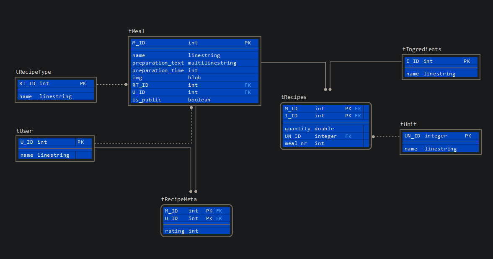

# WebChef

## Was ist WebChef
Eine Website, für simple Speicherung von Rezepen, man kann neue Rezepte erstellen, Bilder hochladen und Zutaten hinzufügen. Es wird alles in einer Datenbank gespeichert, und ist leicht wieder auf zu finden.

>_WebChef_ ist ein kleies Projekt, dass ich im Rahmen mener Ausbildung Erstellt und in meinem lokalen Netzt deployed habe.

---

## Das Projekt / Technische Daten
Das ganze ist mit __HTML__, __SASS__, __JavaScript__ und __PHP__ umgesetzt.
Im hintergrund exestiert eine MySQL-Datenbank (Entity–relationship model siehe unten).

Das bedeuted man braucht nur einen Webserserver mit php und einer MySQL-Datenbank. 

>Ich benutze aktuell einen _Apache v.2.4.38_ Webserver mit _PHP v.7.3.19-1_ und einer _MariaDB v.10.3.25_ Datenbank. Das ganze läuft auf einem _Raspberry Pi model 3b_ mit einem headless _Raspbian_ operating system.

---

### Entity–relationship model

>Das Entity–relationship model hat sich mitlerweihle etwas verändert. Genaueres kann man aus der __localhost.sql__ entnehme.

>Es werden außerdem noch nicht alle tables und values genutzt, z.B. _tUser_ und _tRecipeMeta_ exestieren aber sind noch nicht richtig in das Project integriert.

---

## Der Aufbau der Website

* Rezept
    * Hauptgerichte
    * Vorspeisen
    * Desserts
    * Backen
    * Anderes
* Wass soll ich kochen
* Rezept erstellen
* Einstellungen

---

*by Marc Beyer*